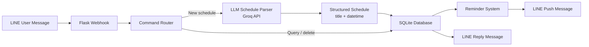

# Schedule LINE Bot: LLM-Powered Reminder Assistant

Schedule LINE Bot is a personal AI automation prototype that lets users create and manage reminders through natural language messages in LINE.

The project combines a LINE webhook, an LLM-based schedule parser, SQLite persistence, and a background reminder loop to turn casual Mandarin messages such as "明天早上 9 點開會" into structured schedule records and reminder notifications.

## Overview

This repository demonstrates a lightweight applied AI workflow:

- receive user messages from LINE
- parse natural language schedule requests with an LLM API
- convert parsed results into structured datetime and title fields
- store schedules in SQLite
- support schedule lookup and soft deletion commands
- send reminders before scheduled events
- deploy as a Flask service on Render

The project is intended as a personal productivity automation prototype, not a production calendar system.

## System Workflow



## Key Features

- **Natural language schedule creation**: parses Mandarin schedule messages into structured records.
- **Schedule queries**: supports commands such as today's schedule, tomorrow's schedule, this week's schedule, and all upcoming schedules.
- **Soft deletion**: deletes schedules by ID without physically removing records from the database.
- **Automatic reminders**: checks schedules and sends reminders before events.
- **LINE Bot integration**: uses LINE Messaging API for webhook replies and push notifications.
- **Render-friendly deployment**: includes `Procfile`, `runtime.txt`, and health endpoints.

## Tech Stack

- **Language**: Python
- **Web framework**: Flask
- **Messaging platform**: LINE Bot SDK
- **LLM API**: Groq OpenAI-compatible chat completion endpoint
- **Database**: SQLite
- **Deployment target**: Render

## Repository Structure

```text
.
├── app.py              # Flask app, webhook routing, LINE message handling
├── schedule_parser.py  # LLM-based natural language schedule parser
├── database.py         # SQLite schedule storage and query helpers
├── reminder.py         # Background reminder checking and push messages
├── requirements.txt
├── Procfile
├── runtime.txt
└── README.md
```

## Setup

Install dependencies:

```bash
pip install -r requirements.txt
```

Create a local `.env` file based on `.env.example`:

```bash
LINE_CHANNEL_ACCESS_TOKEN=your_line_channel_access_token
LINE_CHANNEL_SECRET=your_line_channel_secret
GROQ_API_KEY=your_groq_api_key
RENDER_EXTERNAL_URL=https://your-render-service.onrender.com
PORT=8000
```

Run locally:

```bash
python app.py
```

The service exposes:

```text
GET  /        service status
GET  /health  health check
POST /webhook LINE webhook endpoint
```

## Example Commands

Users can interact with the bot in Mandarin:

```text
明天早上9點開會
後天下午2點聚餐
今天行程
明天行程
本週行程
所有行程
刪除 #123
幫助
```

## Environment Variables

| Variable | Purpose |
|---|---|
| `LINE_CHANNEL_ACCESS_TOKEN` | LINE Messaging API access token |
| `LINE_CHANNEL_SECRET` | LINE webhook signature secret |
| `GROQ_API_KEY` | API key for LLM-based schedule parsing |
| `RENDER_EXTERNAL_URL` | Render service URL used by the keep-alive helper |
| `PORT` | Flask server port |

## Security Notice

This repository does not include API keys, LINE credentials, or local database files. Credentials should be provided through environment variables only.

## Limitations

- The parser depends on an external LLM API and may fail if the API is unavailable.
- Reminder delivery depends on the running server and LINE Messaging API availability.
- SQLite is suitable for a lightweight prototype but is not intended for a large multi-user production service.
- The keep-alive helper is designed for free-tier hosting behavior and may not be needed in other environments.
